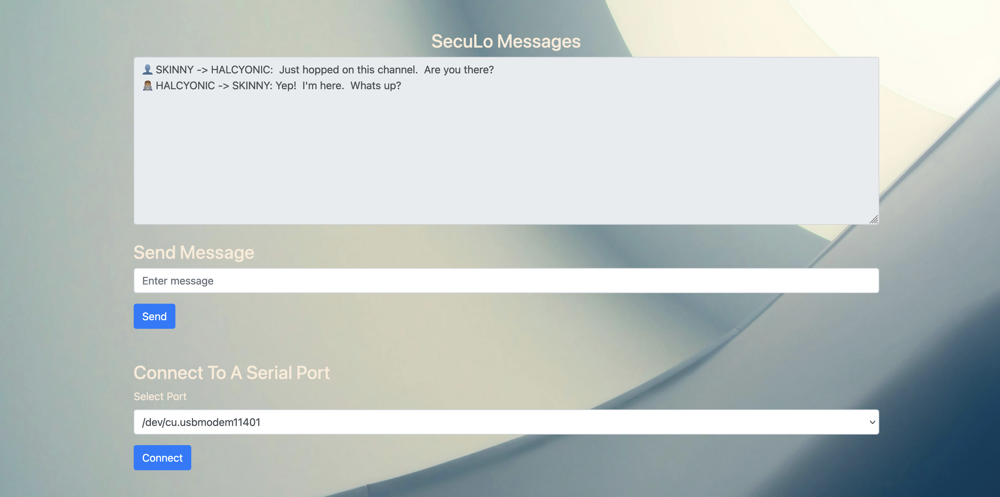
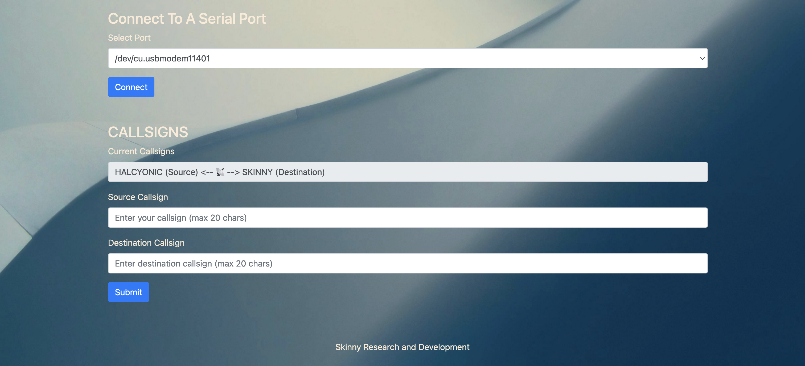

## SecuLo - Secure LoRa Communication Tool

SecuLo is a versatile and secure messaging tool that utilizes LoRa technology. It offers features such as callsign support, encryption, customizable messaging options, and transmission parameter adjustments. SecuLo is designed to facilitate secure and reliable communication in various scenarios.

### Features

- **Callsign Support**: Users can set their own callsign and destination callsign for easy identification and targeted messaging.  The application also supports broadcast messaging, allowing users to send messages to every device in the vicinity.
- **Encryption**: SecuLo employs encryption to secure messages, ensuring confidentiality during transmission.
- **Versatile Messaging**: Users can send and receive messages through a user-friendly interface, with the ability to view sent and received messages.
- **Customizable Transmission**: The application utilizes an **Adafruit Feather M0 LoRa (or 32u4)** as the transceiver.  The firmware source code for the microcontroller is provided by [Skinny LoRa](https://github.com/skinnyrad/Skinny-LoRa/blob/main/skinny-lora.ino).  This allows you to change the frequency, spreading factor, coding rate, and bandwith parameters of the device.

### Supported Hardware

* Adafruit Feather M0 LoRa
* Adafruite Feather 32u4 LoRa

### Hardware Configuration

The firmware source code for the microcontroller is provided by [Skinny LoRa](https://github.com/skinnyrad/Skinny-LoRa/blob/main/skinny-lora.ino).  This allows you to change the frequency, spreading factor, coding rate, and bandwith parameters of the device. 

#### 1. Install the necessary libraries for the Adafruit Feather M0 with RFM95 LoRa Radio:

* https://learn.adafruit.com/adafruit-feather-m0-radio-with-lora-radio-module/setup
* https://learn.adafruit.com/adafruit-feather-m0-radio-with-lora-radio-module/using-with-arduino-ide

#### 2. Flash the Adafruit Feather M0:

* Open the [skinny-lora.ino](https://github.com/skinnyrad/Skinny-LoRa/blob/main/skinny-lora.ino) file in Arduino IDE
* Select Tools -> Board -> Adafruit SAMD Boards -> Adafruit Feather M0 (SAMD21)
* Select Tools -> Port -> [Your Adafruit Feather M0]
* Select Sketch -> Include Library -> Add .Zip Library -> Select the RadioHead.zip file from this repository
* Click the Upload Button

### Software Installation

#### 1. **Clone the repository**:
```bash
git clone git@github.com:skinnyrad/SecuLo.git
```

#### 2. **Navigate to the project directory**:
```bash
cd SecuLo
```

#### 3. **Install the required dependencies**:
```bash
pip install -r requirements.txt
```

On most Linux distributions, serial ports are owned by the dialout group. Adding your user to this group can grant the necessary permissions to access your Adafruit Feather M0.

```bash
sudo usermod -aG dialout $USER
```

After running this command, you need to log out and log back in for the changes to take effect.

#### 4. **Run the application**:
```bash
python app.py
```

#### 5. **Open your web browser and navigate to `http://localhost:5000`**



### Usage

1. **Connect to a serial port**: Select the appropriate serial port from the dropdown menu and click "Connect".

2. **Set your callsign and destination callsign**: Enter your callsign and the destination callsign in the respective fields. The callsigns are limited to 20 characters.  You can either send a direct message by putting in the callsign of your desired recipient in the 'Destination Callsign' section, or **send a broadcast message to all SecuLo devices by entering in 'BROADCAST' for the destination callsign.**



3. **Send a message**: Type your message in the "Send Message" section and click "Send". The message will be encrypted and transmitted.

4. **View received messages**: Incoming messages will be displayed in the "SecuLo Messages" section. Received messages intended for the current user or broadcast messages will be shown.

### Contributing

We welcome contributions to enhance SecuLo's functionality and improve its codebase. If you encounter any issues or have suggestions for improvements, please feel free to open an issue or submit a pull request.

### License

SecuLo is released under the [MIT License](LICENSE).
